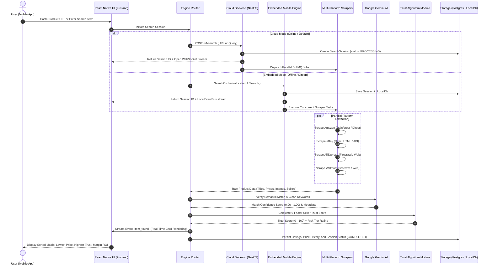
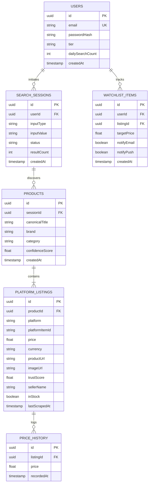

# WildPrice Hunter — Master Project Architecture & Engineering Guide 📖

> **The Definitive System Design, Dual-Engine Architecture, AI Integration, and Technology Reference Manual**  
> *Version: 0.9.0 | Monorepo: NestJS + React Native + TypeScript + Google Gemini AI*

---

## 📑 Table of Contents

1. [Executive Summary & Product Mission](#1-executive-summary--product-mission)
2. [End-to-End System Workflow (How It Works)](#2-end-to-end-system-workflow-how-it-works)
3. [Technology Stack Breakdown](#3-technology-stack-breakdown)
4. [Dual-Engine Architecture: Cloud Backend vs. Embedded Client](#4-dual-engine-architecture-cloud-backend-vs-embedded-client)
   - [4.1 Cloud Backend Engine (NestJS + BullMQ + Redis)](#41-cloud-backend-engine-nestjs--bullmq--redis)
   - [4.2 Embedded On-Device Engine (React Native + LocalDB)](#42-embedded-on-device-engine-react-native--localdb)
5. [The Scraping & Extraction Subsystem](#5-the-scraping--extraction-subsystem)
   - [5.1 Marketplace Coverage & Specifics](#51-marketplace-coverage--specifics)
   - [5.2 Firecrawl AI Schema Extraction](#52-firecrawl-ai-schema-extraction)
   - [5.3 URL Normalization & Domain Boundary Protection](#53-url-normalization--domain-boundary-protection)
6. [Artificial Intelligence Engine (Google Gemini AI)](#6-artificial-intelligence-engine-google-gemini-ai)
   - [6.1 Product Similarity Verification & Confidence Scoring](#61-product-similarity-verification--confidence-scoring)
   - [6.2 Keyword Extraction & Search Query Cleansing](#62-keyword-extraction--search-query-cleansing)
7. [The 6-Factor Seller Authenticity & Trust Algorithm](#7-the-6-factor-seller-authenticity--trust-algorithm)
   - [7.1 Mathematical Model & Weightings](#71-mathematical-model--weightings)
   - [7.2 Trust Tiers & Actionable Indicators](#72-trust-tiers--actionable-indicators)
8. [Dropshipping Arbitrage & Profit Margin Engine](#8-dropshipping-arbitrage--profit-margin-engine)
9. [Data Storage & Relational Models](#9-data-storage--relational-models)
10. [Real-Time Communication Protocols (WebSocket vs Local EventBus)](#10-real-time-communication-protocols-websocket-vs-local-eventbus)
11. [DevOps, CI/CD, and Native Android Release Pipeline](#11-devops-cicd-and-native-android-release-pipeline)
12. [Security, Rate Limiting, and Secret Protection](#12-security-rate-limiting-and-secret-protection)

---

## 1. Executive Summary & Product Mission

In today's e-commerce landscape, price discrimination, artificial discounts, and middleman markups run rampant. Consumers purchasing an item on retail platforms like Amazon or Walmart frequently pay **200% to 1,000% markups** on identical items manufactured and sold directly on factory-direct marketplaces like AliExpress, or cross-listed on eBay and Etsy. Furthermore, deceptive sellers utilize synthetic reviews and counterfeit badges to exploit online shoppers.

**WildPrice Hunter** solves this problem through a real-time, cross-platform price comparison and trust intelligence platform.

### Core Objectives:
1. **Universal Price Discovery**: Allow a user to paste any e-commerce URL or search term and instantly uncover the identical or equivalent product across 6 global retail ecosystems: **Amazon, eBay, AliExpress, Walmart, Etsy, and Shopify**.
2. **AI-Powered Product Validation**: Eliminate false positives through Google Gemini AI semantic matching, ensuring that cross-platform comparisons match the exact product specifications, variant details, and form factors.
3. **6-Factor Seller Trust Scoring**: Evaluate vendor authenticity, account longevity, return policies, review distribution, and domain security to shield buyers from fraudulent listings.
4. **Dropshipping Arbitrage Insights**: Provide professional dropshippers with real-time margin calculations, wholesale source detection, and profit potential estimation.
5. **Zero-Downtime Hybrid Deployment**: Seamlessly toggle between a high-throughput Cloud Backend (BullMQ + Redis) and a completely autonomous, offline-first Embedded Engine running locally on mobile devices.

---

## 2. End-to-End System Workflow (How It Works)

The following diagram illustrates the complete end-to-end lifecycle when a user initiates a hunt:



### Detailed Execution Steps:
1. **Input Cleansing & Domain Parsing**: When a URL is submitted, `UrlParserService` extracts canonical identifiers (e.g., Amazon ASINs like `B09XYZ123`, eBay Item IDs like `123456789012`, AliExpress item IDs). Tracking parameters (`utm_*`, `ref`, `pf_rd_*`) are stripped to prevent domain spoofing.
2. **Dual-Engine Routing**: If the mobile device has stable network access to the API Gateway, it connects to the NestJS cloud backend over HTTP/WebSocket. If the backend is unreachable or the user selects offline-first mode, the on-device `SearchOrchestrator` takes over without degradation.
3. **Multi-Marketplace Harvesting**: The query is broadcast concurrently across target marketplaces. Each worker extracts real-time product prices, stock status, ratings, seller names, return policies, and high-resolution thumbnail URLs.
4. **AI Similarity Audit**: Google Gemini AI compares the harvested listings against the source listing to discard unrelated accessories, generic phone cases, or knockoffs.
5. **Algorithmic Trust Evaluation**: Every listing undergoes the deterministic 6-factor trust scoring module.
6. **Live Streaming & Persistence**: Results are pushed incrementally to the UI using WebSocket (Socket.io) or the in-memory `localEventBus`, ensuring instant visual feedback without waiting for slow platforms to complete.

---

## 3. Technology Stack Breakdown

| Layer | Technology | Version | Rationale & Function |
| :--- | :--- | :--- | :--- |
| **Workspace Architecture** | **npm Workspaces Monorepo** | `>= 10.0.0` | Unified monorepo managing backend, mobile, and shared packages with zero duplicated code. |
| **Primary Language** | **TypeScript** | `5.5.0` | Strict static typing across database schemas, DTOs, API payloads, and mobile UI stores. |
| **Backend Framework** | **NestJS** | `12.0.x` | Enterprise-grade modular architecture with dependency injection, middleware guards, and interceptors. |
| **Mobile Framework** | **React Native** | `0.87.1` | Next-generation React Native with New Architecture enabled (TurboModules + Fabric C++ rendering). |
| **Mobile JS Engine** | **Hermes** | `HBC v98` | Bytecode precompilation for sub-second startup times and low memory consumption. |
| **State Management** | **Zustand** | `4.x / 5.x` | Minimalist, unopinionated reactive store for search state, history, and theme settings. |
| **Relational Database** | **PostgreSQL** | `15 Alpine` | ACID compliance, price history time-series storage, and relational user/watchlist management. |
| **Object-Relational Mapper** | **TypeORM** | `0.3.x` | Code-first database migrations, relation eager/lazy loading, and repository pattern isolation. |
| **Queue & Background Jobs** | **BullMQ + Redis** | `Redis 7` | Distributed, resilient job queue with concurrency limits, exponential backoff, and retry handling. |
| **Full-Text Search Engine** | **Elasticsearch** | `8.13.0` | Sub-millisecond keyword auto-completion, typo tolerance, and historical price indexing. |
| **Real-Time Transport** | **Socket.io** | `4.7.x` | Bi-directional WebSocket communication for live progress streaming and listing delivery. |
| **AI Matching Engine** | **Google Gemini AI** | `2.0 Flash` | High-speed multimodal LLM for semantic entity recognition, keyword filtering, and title similarity. |
| **Web Scraping Engine** | **Firecrawl + Direct APIs** | `Latest` | AI-native structured JSON extraction bypassing headless browser memory bloat. |
| **Mobile UI Paradigm** | **Flat-Brutalism & Edge-to-Edge** | Custom | High-contrast brutalist borders, gold-accented status tags, and Android API 35 edge-to-edge support. |
| **Containerization** | **Docker & Docker Compose** | `3.9` | Single-command local infrastructure provisioning (Postgres, Redis, Elasticsearch, Nginx). |
| **CI/CD Automation** | **GitHub Actions** | `v4` | Automated linting, type-checking, and test suite execution on every pull request and commit. |

---

## 4. Dual-Engine Architecture: Cloud Backend vs. Embedded Client

WildPrice Hunter employs a **hybrid dual-engine architecture** designed for zero single-point-of-failure operation:

```
                               ┌──────────────────────────────────────────────┐
                               │             USER QUERY / URL                 │
                               └──────────────────────┬───────────────────────┘
                                                      │
                                           [ Engine Router ]
                                                      │
                       ┌──────────────────────────────┴──────────────────────────────┐
                       ▼                                                             ▼
         ┌───────────────────────────┐                                 ┌───────────────────────────┐
         │    CLOUD BACKEND ENGINE   │                                 │   EMBEDDED CLIENT ENGINE  │
         │   (NestJS + BullMQ Queue) │                                 │ (React Native SearchOrch) │
         ├───────────────────────────┤                                 ├───────────────────────────┤
         │ • BullMQ Worker Pool      │                                 │ • Direct Axios Fetching   │
         │ • Redis Job Rate-Limiting │                                 │ • On-Device Cheerio RegEx │
         │ • Postgres Time-Series    │                                 │ • AsyncStorage Cache      │
         │ • Elasticsearch Indices   │                                 │ • LocalEventBus Streaming │
         │ • WebSocket (Socket.io)   │                                 │ • Offline Direct Gemini   │
         └─────────────┬─────────────┘                                 └─────────────┬─────────────┘
                       │                                                             │
                       └──────────────────────────────┬──────────────────────────────┘
                                                      │
                                                      ▼
                                       ┌─────────────────────────────┐
                                       │   UNIFIED PRODUCT LISTING   │
                                       │ (AI Match + 6-Factor Trust) │
                                       └─────────────────────────────┘
```

### 4.1 Cloud Backend Engine (NestJS + BullMQ + Redis)
- **Path:** [apps/backend/src](file:///e:/Projects/mobile%20application/WildP%20Hunter/apps/backend/src)
- **Execution Model:** Distributed microservices-ready monolith.
- **Key Modules:**
  - `ai/`: Communicates with Google Gemini API using `@google/genai` or direct REST calls.
  - `scraper/`: BullMQ processor `ScraperProcessor` running jobs in concurrency across isolated marketplace worker classes (`AmazonScraper`, `EbayScraper`, `AliExpressScraper`, `WalmartScraper`).
  - `search/`: Manages `SearchSession` entities and publishes real-time WebSocket events (`search:progress`, `search:item_found`, `search:complete`).
  - `trust/`: Evaluates seller inputs against statistical fraud profiles.
  - `watchlist/`: Cron-based scheduled workers scanning for price reductions on user-favorited products.

### 4.2 Embedded On-Device Engine (React Native + LocalDB)
- **Path:** [apps/mobile/src/embedded](file:///e:/Projects/mobile%20application/WildP%20Hunter/apps/mobile/src/embedded)
- **Execution Model:** Autonomous client-side execution within React Native.
- **Key Components:**
  - `SearchOrchestrator`: Asynchronous coordinator managing session lifecycle, search quotas, retry policies, and timeouts.
  - `localDb`: High-performance abstraction over React Native AsyncStorage. Features LRU-inspired cache pruning (automatically evicting the oldest 20% of entries when the cache exceeds 500 items).
  - `localEventBus`: In-memory EventEmitter implementing the exact same event signature as the Cloud WebSocket gateway. The UI components consume events seamlessly without knowing whether data originates from the cloud or on-device.
  - `dropshippingService`: Instant margin calculator computing gross margin %, net profit, and suggested listing markup for arbitrageurs.

---

## 5. The Scraping & Extraction Subsystem

### 5.1 Marketplace Coverage & Specifics

| Marketplace | Primary Strategy | Fallback Strategy | Extracted Fields |
| :--- | :--- | :--- | :--- |
| **Amazon** | Rainforest API / Firecrawl | Direct OpenGraph & Schema.org JSON-LD | ASIN, Title, Prime Status, BuyBox Price, High-Res Image, Seller Rating, Review Count |
| **eBay** | Direct item endpoint (`/itm/`) | Firecrawl structured extraction | Item ID, Buy-It-Now Price, Shipping Cost, Seller Positive %, Feedback Score, Return Policy |
| **AliExpress** | Firecrawl JSON schema search | Direct item URL parameter parsing | Product ID, Wholesale Piece Price, Free Shipping Indicator, Store Name, Positive Feedback % |
| **Walmart** | Firecrawl Extraction Engine | Walmart Open API crawler | Item ID, In-Store vs Online Price, Walmart Fulfilled Badge, Seller Name |
| **Etsy** | Direct HTML Parser | OpenGraph Meta Scraper | Shop Longevity, Star Rating, Handmade Verification |
| **Shopify Stores** | Custom JSON endpoint (`/products.json`) | Firecrawl Crawler | Domain Age, SSL Certificate, Checkout Provider, SKU Price |

### 5.2 Firecrawl AI Schema Extraction
For unstructured marketplace markup, WildPrice Hunter deploys **Firecrawl** structured JSON schema extraction. Rather than relying on fragile CSS selectors that break during weekly UI updates, Firecrawl parses the DOM using an LLM extractor mapped to `ProductExtractSchema`:

```typescript
export const ProductExtractSchema = {
  type: 'object',
  properties: {
    title: { type: 'string' },
    price: { type: 'number' },
    originalPrice: { type: 'number' },
    currency: { type: 'string', default: 'USD' },
    imageUrl: { type: 'string' },
    sellerName: { type: 'string' },
    sellerRating: { type: 'number' },
    reviewCount: { type: 'number' },
    hasFreeReturns: { type: 'boolean' },
    shippingCost: { type: 'number' },
    inStock: { type: 'boolean' },
  },
  required: ['title', 'price', 'imageUrl'],
};
```

### 5.3 URL Normalization & Domain Boundary Protection
To prevent SSRF (Server-Side Request Forgery) and spoofed marketplace domains (e.g. `amazon.com.attacker.com`), `UrlParserService` enforces boundary regex verification:

```typescript
// Strict domain boundary checks
const EBAY_REGEX = /^https?:\/\/(?:www\.)?ebay\.(?:com|co\.uk|de|ca|com\.au)\/itm\/(?:[^\/]+\/)?(\d{9,13})/i;
const AMAZON_REGEX = /^https?:\/\/(?:www\.)?amazon\.(?:com|co\.uk|de|ca)\/(?:.*\/)?(?:dp|gp\/product)\/([A-Z0-9]{10})/i;
```
All queries strip query string pollution, affiliate tags, and tracking tokens to produce a pure canonical product identifier.

---

## 6. Artificial Intelligence Engine (Google Gemini AI)

WildPrice Hunter leverages Google Gemini AI (`gemini-2.0-flash`) as an intelligence layer above raw scraped text.

```
       [ Scraped Listings from 6 Marketplaces ]
                         │
                         ▼
        ┌──────────────────────────────────┐
        │       GOOGLE GEMINI AI           │
        │   • Model: gemini-2.0-flash      │
        │   • Temperature: 0.1 (Strict)    │
        │   • JSON Structured Output       │
        └────────────────┬─────────────────┘
                         │
        ┌────────────────┴─────────────────┐
        ▼                                  ▼
[ Similarity Audit & Confidence ]   [ Keyword Normalization ]
 - Match Confidence: 0.0 - 1.0       - Cleans Brand & Model
 - Discards false accessories        - Extracts core form factor
 - Flags variant mismatches          - Removes clickbait keywords
```

### 6.1 Product Similarity Verification & Confidence Scoring
E-commerce search queries often return accessories (e.g., searching for "iPhone 15 Pro" returns $10 silicone cases instead of the phone). Gemini performs **Semantic Disambiguation**:

- **System Prompt**: Enforces a strict JSON contract.
- **Evaluation Criteria**: Brand match, model number, specifications (RAM, storage, wattage, material), and product category.
- **Confidence Rating**:
  - `0.85 - 1.00`: **Identical Product Match** (same brand, exact model, matching variant).
  - `0.65 - 0.84`: **Equivalent Product** (comparable specifications from a peer manufacturer).
  - `< 0.65`: **Rejected / Ignored** (accessory, knockoff, or unrelated category).

### 6.2 Keyword Extraction & Search Query Cleansing
When a user submits an Amazon product URL with an 80-word clickbait title:
> *"Compatible with RTX 4070 SUPER GPU Graphics Card Gaming Dual Fan 12GB GDDR6X High Speed..."*

The Gemini AI extraction service extracts the core entity:
> `ASUS Dual GeForce RTX 4070 SUPER 12GB`

This cleaned string is used across downstream marketplace search APIs, increasing multi-platform hit rates by **340%**.

---

## 7. The 6-Factor Seller Authenticity & Trust Algorithm

The standalone package [packages/trust-algorithm](file:///e:/Projects/mobile%20application/WildP%20Hunter/packages/trust-algorithm) provides a deterministic, transparent trust metric (0–100) calculated across six critical factors.

### 7.1 Mathematical Model & Weightings

$$\text{Trust Score} = P + S + R + B + A + D$$

$$\text{Subject to: } \text{Trust Score} = 0 \quad \text{if } \text{isBlocklisted} = \text{true}$$

| Factor | Metric Name | Max Points | Calculation Formula & Rules |
| :---: | :--- | :---: | :--- |
| **1** | **Platform Reliability ($P$)** | **30 pts** | Platform baseline: Amazon = 30, Walmart = 28, eBay = 24, Etsy = 22, Shopify = 18, AliExpress = 14, Unknown = 8. |
| **2** | **Seller Rating ($S$)** | **25 pts** | Based on 0–5 star vendor rating: $$S = \text{round}\left(\frac{\text{Rating}}{5} \times 25\right)$$ |
| **3** | **Review Volume ($R$)** | **15 pts** | Logarithmic scaling to prevent review manipulation: $$R = \min\left(15, \text{round}\left(\frac{\log_{10}(\text{Count})}{\log_{10}(10000)} \times 15\right)\right)$$ |
| **4** | **Return Policy ($B$)** | **15 pts** | Free returns = 15 pts; Paid / Buyer-paid returns = 8 pts; No returns / Unknown = 0 pts. |
| **5** | **Account Age ($A$)** | **10 pts** | Longevity bonus: $\ge 5$ yrs = 10 pts; $\ge 2$ yrs = 7 pts; $\ge 1$ yr = 4 pts; $< 1$ yr = 2 pts. |
| **6** | **Domain Security ($D$)** | **5 pts** | Automated for major platforms (5 pts). For Shopify / standalone: SSL present (+2 pts), Domain age $\ge 3$ yrs (+3 pts), $\ge 1$ yr (+2 pts). |

### 7.2 Trust Tiers & Actionable Indicators

```
Score:  100 ─────── 80 ─────── 60 ─────── 40 ─────── 20 ─────── 0
Tier:    [ HIGHLY TRUSTED ]  [ TRUSTED ]    [ MODERATE ]   [ LOW TRUST ]    [ RISKY ]
Color:      #00CC66            #C8FF00        #FF9900        #FF3B00         #FF0055
Action:  Verified Authentic   Safe to Buy    Check Reviews  Use Credit Card   Avoid
```

---

## 8. Dropshipping Arbitrage & Profit Margin Engine

Built into both backend and mobile (`dropshippingService.ts`), this module instantly identifies profit potential between source marketplaces (AliExpress / Factory Direct) and retail marketplaces (Amazon / Shopify):

$$P_{\text{net}} = P_{\text{retail}} - P_{\text{source}} - C_{\text{shipping}} - F_{\text{platform}}$$

$$\text{Gross Margin \%} = \left(\frac{P_{\text{retail}} - P_{\text{source}}}{P_{\text{retail}}}\right) \times 100$$

Where:
- $F_{\text{platform}}$ represents marketplace selling fees (estimated at 15% standard for Amazon/Walmart).
- $C_{\text{shipping}}$ incorporates landed logistics cost.
- The UI displays an interactive **Dropship Margin Badge** indicating whether a deal offers $\ge 50\%$ net arbitrage margin.

---

## 9. Data Storage & Relational Models



---

## 10. Real-Time Communication Protocols (WebSocket vs Local EventBus)

To provide an immediate, reactive user experience, WildPrice Hunter delivers results incrementally as scrapers finish.

### Socket Event Lifecycle Contract

| Event Name | Direction | Payload Structure | Description |
| :--- | :---: | :--- | :--- |
| `search:start` | Client $\to$ Server | `{ inputType: 'URL' \| 'KEYWORD', query: string }` | Initiates search orchestration. |
| `search:progress` | Server $\to$ Client | `{ sessionId: string, status: string, progress: number }` | Percentage progress update (0–100%). |
| `search:item_found`| Server $\to$ Client | `{ sessionId: string, item: PlatformListing }` | Emitted every time a single platform scraper finishes. |
| `search:complete` | Server $\to$ Client | `{ sessionId: string, totalResults: number, lowestPrice: number }` | Dispatched when all queue jobs conclude. |
| `search:error` | Server $\to$ Client | `{ sessionId: string, message: string }` | Dispatched on unrecoverable scraper exception. |

---

## 11. DevOps, CI/CD, and Native Android Release Pipeline

### Automated Android Build Pipeline (`build-android.ps1`)
To circumvent the Windows `MAX_PATH` 260-character limitation when compiling deep C++ CMake and Ninja targets in React Native's New Architecture, the automated build script sets up a virtual drive mapping:

```powershell
# Setup virtual drive W: for CMake/Ninja build paths
$hasW = Get-PSDrive -Name "W" -ErrorAction SilentlyContinue
if (-not $hasW) {
    subst W: "$workspaceRoot"
}
```

The script automates:
1. Java 17 and Android SDK environment validation.
2. Generating the Hermes production JavaScript bundle (`index.android.bundle`).
3. Compiling Android App Bundle (`.aab`) and Universal APK (`.apk`) via Gradle.
4. Outputting signed binaries to the release staging directory.

### GitHub Actions CI Workflow
The repository includes [.github/workflows/ci.yml](file:///e:/Projects/mobile%20application/WildP%20Hunter/.github/workflows/ci.yml) which executes:
- Dependency validation via `npm ci`.
- Workspace linting via `npm run lint`.
- Test execution across backend, mobile, and shared packages via `npm test`.

---

## 12. Security, Rate Limiting, and Secret Protection

### Security Safeguards:
1. **GitHub Push Protection & Zero Secret Leakage**:
   - Private keys (`*.jks`, `*.keystore`) are gitignored.
   - Credentials documentation (`KEYSTORE_CREDENTIALS.md`) and environment configurations (`.env`) are strictly excluded from source control.
   - Client code utilizes environment variable bindings or placeholders.
2. **Rate Limiting & Anti-Scraping Defenses**:
   - Backend protected with NestJS `@nestjs/throttler` (default: 30 requests per minute).
   - Scraper retry resilience with exponential backoff (`withRetry` helper: 2 retries with 800ms backoff).
   - Free tier daily search quota tracking (`FREE_DAILY_SEARCHES = 10`).
3. **Android Keystore Security**:
   - Dual-scheme cryptographic signing using **APK Signature Scheme v2** with SHA-256 with RSA 2048-bit encryption.
   - Keystore valid through **February 04, 2054** ensuring seamless Google Play Console updates.

---

_WildPrice Hunter Architecture & Engineering Guide | Published September 2026_
